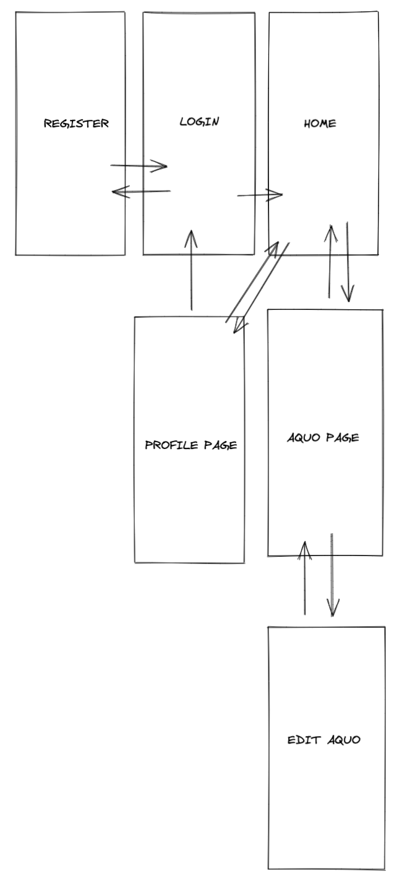
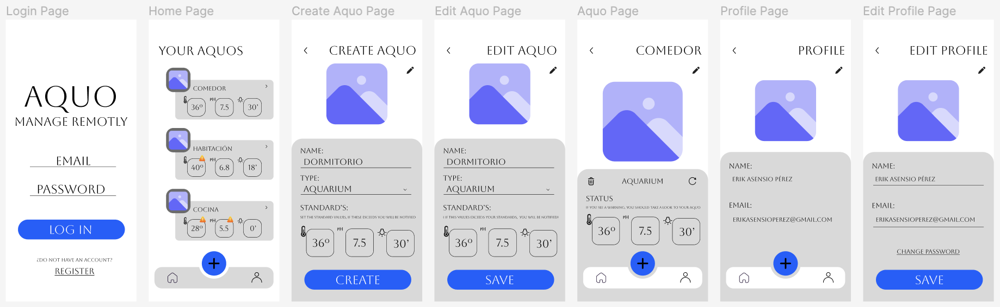
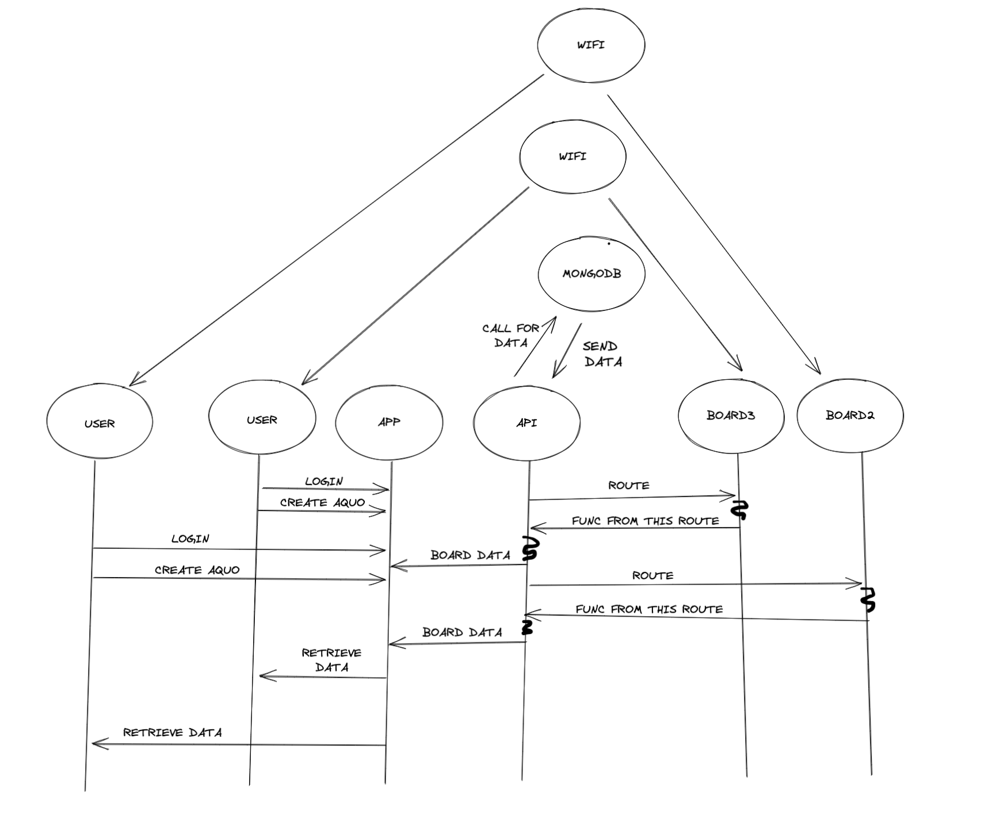
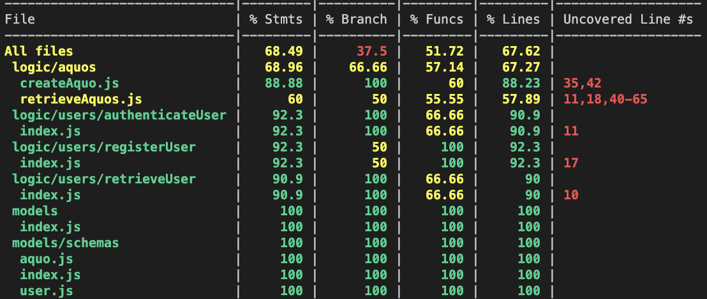

# Aquo Remote Control

"Aquo" is an app capable of retrieve real-time information from your aquos (arduino boards connected to any device), managed by an arduino (NodeMCU) with an integrated api and connected to the same WiFi to communicate by ip's adresses from NodeJS api to Arduino's api.

"Aquo" allows to register as many aquos as you wish, communicating api and app through arduino, that means that you will need and arduino board for each aquo.

"Aquo" is a simply functional app that allows you to see your aquos/devices state, update them as you need and finally a profile page to have a minimum of personal user information where you can log out.

In future versions more options for aquos to read analog inputs and also change outputs, like tiggling leds or changing analog values, also users will have more functionalities like updating their profile information and adding something more like about them or interests. Aquos could be removed from home page, you will not have to enter each one to delete it.

## Functional Description

### Use Cases

#### A non-logged-in user can:
- register to sign up for an account
- log-in to their account with password authentication

#### A logged-in user can:
- navigate to see a list of their own aquos
- navigate to see their profile information
- create a new aquo
- edit their own aquos
- refresh aquos information
- recieve real-time info under petition
- delete their own aquos
- logout

#### When creating an aquo a user can:
- set an aquo name
- set an aquo type
- set an static ip to recieve the pins data
- set the standard/default inputs
- TODO set a customized aquo photo

### Flows
//TODO

### UI design (wireframes)

Below is the initial Figma flow that inspired the project. This flow shows the aquo project first model idea. Since this flow was designed functionality such as the users retrievement, the aquos retrievement and its corresponding real-time data, aquos deletement, aquos editing and profile info retrievement has been added.

[Figma](https://www.figma.com/file/PdFLK7q2AeM16D9z3UqW4G/AQUO?node-id=0%3A1)

## Technical Description

### Blocks

### Code Coverage (Testing)

### Technologies

- Javascript, CSS, HTML, Arduino, C++
- React/JSX
- Node.js
- Express.js
- Axios
- Mongoose from MongoDB
- Jest

## Roadmap

### Version 0

- manage users
- manage aquos
- create, retrieve and update users
- create, retrieve and update aquos

### Version 1

- analog reads
- enable toggle pins
- the ability to upload photo to the aquo
- the ability to upload profile photo
- retrieve aquo without navigating home page

## Tasks

Sprint 0

- DONE figma
- DONE data model
- DONE figma to react
- DONE data model to mongoose
- DONE implement users logic
- DONE implement users api routes
- DONE implement aquos logic
- DONE implement aquos api routes
- DONE create an api inside arduino
- DONE implement arduino api logic
- DONE implement arduino api routes
- DONE communicate app's api and arduino's api

Sprint 1

- TODO ...

Sprint 2

- TODO ...

Sprint 3

- TODO ...

# TODOS:

## Priority:

- Do toggle pin states logic in App (done in Arduino)
- Improve logic - require the token and userId for every logic
- Bug fix - AquoPage in blank when reloading it
- Finish logic testing
- Finish validation of some inputs in app and api
- Logic documentation

## Other TODOs:

- Profile data edition
- Update user profile photo
- Update user email
- Update user password
- Reset forgotten password functionality by email
- Improve validation of game input
- Set an interval for autocall and autorefresh aquo data
- Add analog reads for potentiometer/photoresistor/thermoresistor...
- Management of token - autorenovation if user is still active